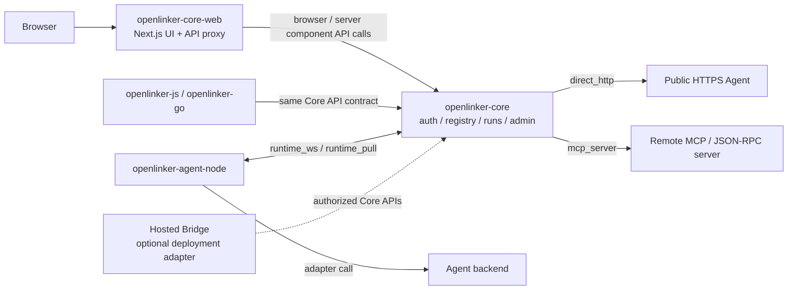

# OpenLinker Core Web

OpenLinker Core Web is the **open-source self-hosted frontend** for
[openlinker-core](https://github.com/OpenLinker-ai/openlinker-core) deployments.
It covers the complete UI surface of an AI agent registry: Agent market, creator
hub, A2A/MCP playground, task workflow console, runtime setup guide, and local
admin dashboard.

> **Repository map**
>
> | Repository | Audience | Open source |
> |-----------|---------|-------------|
> | `openlinker-core` | Backend API server | ✅ Yes |
> | `openlinker-core-web` ← **this repo** | Self-hosted frontend for core | ✅ Yes |
> | Commercial hosted frontend | openlinker.ai cloud-specific features | ❌ Closed source |
>
> The commercial hosted frontend (not in this repo) contains openlinker.ai-specific
> features: wallet, pricing, commercial billing, cloud-only user token dashboards, and
> marketplace ranking UI. These are intentionally excluded from Core Web.

This repository is intentionally limited to Core-owned APIs. Commercial wallet,
billing, withdrawal, and hosted marketplace product surfaces live outside this
package.

Chinese documentation: [README.zh-CN.md](./README.zh-CN.md)

## Status

This frontend is pre-1.0 and follows `openlinker-core` API evolution. Route
names, forms, and API response handling can change while the Core contract is
being stabilized.

## Scope

Included:

- public Agent market, Agent detail pages, and callable playground
- user auth, personal workspace, run history, run detail, inbox, and settings
- creator hub, Agent onboarding, approvals, runtime setup, and delivery views
- A2A console, MCP/connect views, skills, workflows, status, and tasks
- local admin pages backed by `openlinker-core`
- API proxy from `/api/v1/*` to the Core API

Excluded:

- wallet, charges, withdrawals, Stripe, and pricing flows
- commercial User Token product dashboards
- finance administration and hosted marketplace ranking controls
- cloud-only customer account features

## Open-source Architecture

Core Web is a self-hosted UI over Core-owned APIs. If a hosted deployment adds a
bridge, it should stay outside this repository and talk to Core through the same
public boundary.



## Quick Start

Prerequisites:

- Node.js 20 or newer
- npm
- a running `openlinker-core` API, usually on `http://localhost:8080`

Create local configuration:

```bash
cp .env.local.example .env.local
```

Install dependencies and start the development server:

```bash
npm install
npm run dev
```

Default local endpoints:

- Core API: `http://localhost:8080`
- Core Web: `http://localhost:3000`

## Environment

Common local values:

```bash
NEXT_PUBLIC_API_URL=http://localhost:3000
API_URL=http://localhost:8080
CORE_API_URL=http://localhost:8080
NEXTAUTH_SECRET=replace-me-with-32-chars-random-secret
NEXTAUTH_URL=http://localhost:3000
```

`NEXT_PUBLIC_API_URL` should normally point to the web origin so browser calls
use the local Next.js `/api/v1/*` proxy. Server components use `CORE_API_URL`
or `API_URL` to reach Core directly.

`NEXTAUTH_SECRET` must match the JWT/session expectation used by the Core
deployment you are testing against.

## Common Commands

```bash
npm run dev
npm run lint
npx tsc --noEmit
npm run build
npm run start
npm run test:a2a-session
```

## Docker

Build from the parent workspace root:

```bash
docker build -f openlinker-core-web/Dockerfile.server -t openlinker-core-web .
```

The container expects `API_URL` or `CORE_API_URL` to point at the Core API.

## Project Layout

```text
openlinker-core-web/
├── proxy.ts
├── Dockerfile.server
├── src/app/
│   ├── page.tsx
│   ├── runs/
│   ├── my/
│   ├── settings/
│   ├── admin/
│   ├── (creator)/hub/
│   ├── (creator)/publish/
│   ├── registry/
│   └── api/v1/[...path]/route.ts
├── src/components/
└── src/lib/
```

## API Proxy Model

Browser requests should usually call this frontend origin. The catch-all route
under `src/app/api/v1/[...path]/route.ts` forwards Core API traffic to
`CORE_API_URL` or `API_URL`. This keeps browser configuration simple and lets
server components call Core without exposing private deployment details.

## Development Notes

- Keep commercial product flows out of this repository.
- Prefer existing components and layout patterns before adding new UI
  primitives.
- Keep visible text localized through the existing i18n helpers when a page is
  already localized.
- Redact tokens, private URLs, screenshots with customer data, and `.env.local`
  values from public issues.

## Security

Security-sensitive areas include sessions, protected routes, API proxy behavior,
token display/copy flows, user-controlled URLs, and callback surfaces. Report
vulnerabilities through [SECURITY.md](./SECURITY.md).

## Contributing

Read [CONTRIBUTING.md](./CONTRIBUTING.md) before opening a pull request.

## Support and Releases

- Help and issue guidance: [SUPPORT.md](./SUPPORT.md)
- Release checklist: [RELEASE.md](./RELEASE.md)
- Notable changes: [CHANGELOG.md](./CHANGELOG.md)
- Conduct expectations: [CODE_OF_CONDUCT.md](./CODE_OF_CONDUCT.md)

## License

Apache-2.0. See [LICENSE](./LICENSE).
