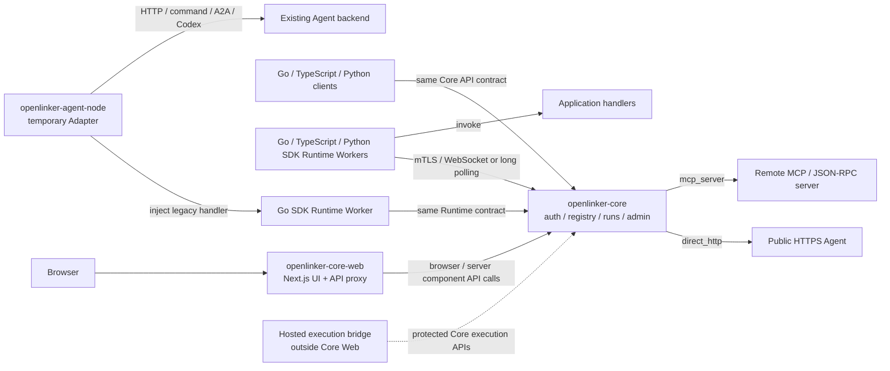

# OpenLinker Core Web

OpenLinker Core Web is the **open-source self-hosted frontend** for
[openlinker-core](https://github.com/OpenLinker-ai/openlinker-core) deployments.
It brings the Agent Registry, connection setup, invocation, run records, and
instance administration into one browser interface. It is built for teams that
want to manage Agents, accounts, and run data on their own infrastructure.

> **Repository map**
>
> | Repository | Audience | Open source |
> |-----------|---------|-------------|
> | `openlinker-core` | Backend API server | ✅ Yes |
> | `openlinker-core-web` ← **this repo** | Self-hosted frontend for core | ✅ Yes |
> | Hosted product frontend | Separate openlinker.ai hosted service | Separate product |
>
> This repository follows the `openlinker-core` API boundary. Operators choose
> their own domain, access model, retention, and operations policy. Hosted accounts,
> commercial billing, and marketplace operations for openlinker.ai are implemented
> in a separate product.

Core Web only calls APIs provided by Core. It runs without an openlinker.ai
hosted account or commercial service.

Chinese documentation: [README.zh-CN.md](./README.zh-CN.md)

## Status

This frontend is pre-1.0 and follows `openlinker-core` API evolution. Route
names, forms, and API response handling can change while the Core contract is
being stabilized.

The `package.json` version belongs to a private application package and is not a
published npm version. Use the Git tag, image label, and coordinated Core
compatibility record to identify a deployment release.

User Token management is part of the Core contract. Core owns local issuance
and verification, while the settings UI supports creating, listing, tightening,
replacing, and revoking tokens. Expiration and Agent-scoped grants can be set at
issuance; plaintext token values are shown only once.

## Scope

Included:

- public Agent Registry, Agent detail pages, and callable playground
- email/password registration and sign-in, personal workspace, run history,
  run detail, inbox, and settings
- local User Token management for scoped user-side API and MCP calls, including
  expiry, least-privilege grants, Agent ranges, replacement, and revocation
- creator hub, setup for the three connection modes, availability alerts,
  benchmarks, and delivery views
- A2A console, MCP/connect views, Skills, service status, and run inspection
- local admin pages backed by `openlinker-core`
- API proxy from `/api/v1/*` to the Core API

Separated from the Core API boundary:

- hosted quick login, account recovery, and managed-account authentication
- service listings, service orders, seller operations, and hosted Agent-market operations
- wallet, charges, withdrawals, Stripe, and pricing flows
- openlinker.ai managed account, token-policy, and commercial access dashboards
- finance administration and hosted marketplace ranking controls
- hosted-only managed account features outside the Core contract

The bundled Core Web authentication UI currently exposes email/password
registration and sign-in. Configuring a Google or GitHub provider in Core does
not add hosted-style quick-login buttons to this frontend.

## Open-source Architecture

Core Web is a self-hosted UI over Core-owned APIs. A Hosted execution bridge
stays outside this repository, uses a protected Core boundary, and never routes
commercial account or order APIs through Core Web.



## Quick Start

Prerequisites:

- Node.js 20 or newer
- npm
- a running `openlinker-core` API, usually on `http://localhost:8080`

Create local configuration:

```bash
cp .env.local.example .env.local
```

Install dependencies and start the development server:

```bash
npm ci
npm run dev
```

Default local endpoints:

- Core API: `http://localhost:8080`
- Core Web: `http://localhost:3000`

When started from the parent workspace with `make dev-core-web`, the devctl
script uses port `3001` instead so Core Web does not collide with the hosted
frontend on `3000`.

## Environment

Common local values:

```bash
NEXT_PUBLIC_API_URL=http://localhost:3000
API_URL=http://localhost:8080
CORE_API_URL=http://localhost:8080
NEXTAUTH_SECRET=replace-me-with-32-chars-random-secret
NEXTAUTH_URL=http://localhost:3000
```

`NEXT_PUBLIC_API_URL` should normally point to the web origin so browser calls
use the local Next.js `/api/v1/*` proxy. Server components use `CORE_API_URL`
or `API_URL` to reach Core directly.

`AUTH_SECRET` or `NEXTAUTH_SECRET` signs the frontend session. Use a separate,
random value in production; do not reuse Core's `JWT_SECRET`. If both frontend
variables are set, keep their values identical.

## Common Commands

```bash
npm run dev
npm run lint
npx tsc --noEmit
npm run build
npm run start
npm run check:i18n
npm run test:a2a-session
npm run test:agent-library-card
```

## Docker

Build from the parent workspace root:

```bash
docker build -f openlinker-core-web/Dockerfile.server -t openlinker-core-web .
```

The container expects `API_URL` or `CORE_API_URL` to point at the Core API.

## Project Layout

```text
openlinker-core-web/
├── src/proxy.ts
├── Dockerfile.server
├── src/app/
│   ├── page.tsx
│   ├── runs/
│   ├── my/
│   ├── settings/
│   ├── admin/
│   ├── (creator)/hub/
│   ├── (creator)/publish/
│   ├── registry/
│   └── api/v1/[...path]/route.ts
├── src/components/
├── src/messages/       # typed, domain-oriented zh/en product copy
└── src/lib/
```

## API Proxy Model

Browser requests should usually call this frontend origin. The catch-all route
under `src/app/api/v1/[...path]/route.ts` forwards Core API traffic to
`CORE_API_URL` or `API_URL`. This keeps browser configuration simple and lets
server components call Core without exposing private deployment details.

## Development Notes

- Keep commercial product flows out of this repository.
- Prefer existing components and layout patterns before adding new UI
  primitives.
- Put reused or substantial feature copy in typed domain modules under
  `src/messages/`. A few one-off labels may stay beside a component; protocol
  fields, code samples, and user data are not translation resources.
- Keep Core product framing instance-scoped. Shared protocol labels may align
  with Hosted Web, but marketplace, billing, and managed-service copy must not
  be forced into Core catalogs.
- Redact tokens, private URLs, screenshots with customer data, and `.env.local`
  values from public issues.

## Security

Security-sensitive areas include sessions, protected routes, API proxy behavior,
token display/copy flows, user-controlled URLs, and callback surfaces. Report
vulnerabilities through [SECURITY.md](./SECURITY.md).

## Contributing

Read [CONTRIBUTING.md](./CONTRIBUTING.md) before opening a pull request. New
pages and flows should be backed by public `openlinker-core` APIs and remain
independently usable in self-hosted deployments.

## Support and Releases

- Help and issue guidance: [SUPPORT.md](./SUPPORT.md)
- Release checklist: [RELEASE.md](./RELEASE.md)
- Notable changes: [CHANGELOG.md](./CHANGELOG.md)
- Conduct expectations: [CODE_OF_CONDUCT.md](./CODE_OF_CONDUCT.md)

## License

Apache-2.0. See [LICENSE](./LICENSE).
