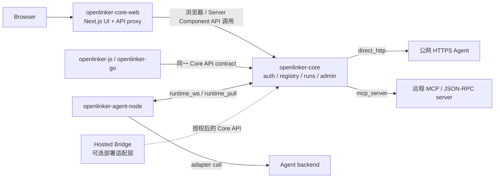

# OpenLinker Core Web

OpenLinker Core Web 是配套 [openlinker-core](https://github.com/OpenLinker-ai/openlinker-core) 自托管部署的**开源前端**。
它覆盖 AI Agent 注册中心的完整 UI 面：Agent 市场、创作者工作台、A2A/MCP Playground、
任务工作流控制台、runtime 设置引导和本地管理员面板。

> **仓库地图**
>
> | 仓库 | 定位 | 是否开源 |
> |----|----|----|
> | `openlinker-core` | 后端 API 服务 | ✅ 开源 |
> | `openlinker-core-web` ← **本仓库** | Core 的自托管前端 | ✅ 开源 |
> | 商业化托管前端 | openlinker.ai 专属功能 | ❌ 不开源 |
>
> 商业化托管前端（不在本仓库）包含 openlinker.ai 专属功能：钉包、定价、商业计费、
> 云端用户 Token 产品面板和市场排序 UI。这些功能有意从 Core Web 中剔除。

English documentation: [README.md](./README.md)

本仓库只调用 Core 拥有的 API。商业钱包、计费、提现和托管市场产品能力不属于本仓库。

## 状态

本前端目前是 pre-1.0，并跟随 `openlinker-core` API 演进。Core 契约稳定前，路由、
表单和 API 响应处理仍可能变化。

## 范围

包含：

- 公开 Agent 市场、Agent 详情页和可调用 Playground
- 用户认证、个人工作区、run 历史、run 详情、Inbox 和设置
- Creator Hub、Agent onboarding、审批、runtime 设置和交付视图
- A2A console、MCP/connect、skills、workflows、status 和 tasks
- 由 `openlinker-core` 支持的本地 admin 页面
- `/api/v1/*` 到 Core API 的代理

不包含：

- 钱包、扣费、提现、Stripe 和价格页面
- 商业 User Token 产品 Dashboard
- 财务管理和托管市场排序控制
- Cloud-only 客户账户功能

## 开源架构图

Core Web 是面向 Core-owned API 的自托管 UI。托管部署如果需要 bridge，应在本仓库之外实现，
并通过同一组公开 Core API 边界接入。



## 快速开始

依赖：

- Node.js 20 或更高版本
- npm
- 正在运行的 `openlinker-core` API，通常是 `http://localhost:8080`

创建本地配置：

```bash
cp .env.local.example .env.local
```

安装依赖并启动开发服务器：

```bash
npm install
npm run dev
```

默认本地地址：

- Core API: `http://localhost:8080`
- Core Web: `http://localhost:3000`

## 环境变量

常见本地配置：

```bash
NEXT_PUBLIC_API_URL=http://localhost:3000
API_URL=http://localhost:8080
CORE_API_URL=http://localhost:8080
NEXTAUTH_SECRET=replace-me-with-32-chars-random-secret
NEXTAUTH_URL=http://localhost:3000
```

`NEXT_PUBLIC_API_URL` 通常指向前端自身，让浏览器请求走本地 Next.js `/api/v1/*`
代理。Server Components 使用 `CORE_API_URL` 或 `API_URL` 直接访问 Core。

## 常用命令

```bash
npm run dev
npm run lint
npx tsc --noEmit
npm run build
npm run start
npm run test:a2a-session
```

## Docker

从父工作区根目录构建：

```bash
docker build -f openlinker-core-web/Dockerfile.server -t openlinker-core-web .
```

容器需要 `API_URL` 或 `CORE_API_URL` 指向 Core API。

## API 代理模型

浏览器请求通常访问前端 origin。`src/app/api/v1/[...path]/route.ts` 会把 Core API
流量转发到 `CORE_API_URL` 或 `API_URL`。这样浏览器配置更简单，也避免暴露私有部署细节。

## 开发注意事项

- 不要把商业产品流程放进本仓库。
- 优先复用现有组件和布局模式。
- 已经接入 i18n 的页面需要保持本地化。
- 公开 Issue 前删除 token、私有 URL、客户数据和 `.env.local`。

## 安全

敏感区域包括 session、受保护路由、API proxy、token 展示/复制、用户可控 URL 和回调面。
漏洞请通过 [SECURITY.zh-CN.md](./SECURITY.zh-CN.md) 报告。

## 贡献

提交 PR 前请阅读 [CONTRIBUTING.zh-CN.md](./CONTRIBUTING.zh-CN.md)。这个仓库只面向
开源 Core UI，不应加入钱包、扣费、提现或商业 Dashboard 页面。

## 支持和发布

- 支持说明：[SUPPORT.zh-CN.md](./SUPPORT.zh-CN.md)
- 发布清单：[RELEASE.zh-CN.md](./RELEASE.zh-CN.md)
- 英文变更记录：[CHANGELOG.md](./CHANGELOG.md)
- 行为准则：[CODE_OF_CONDUCT.md](./CODE_OF_CONDUCT.md)

## 许可证

Apache-2.0。详见 [LICENSE](./LICENSE)。
