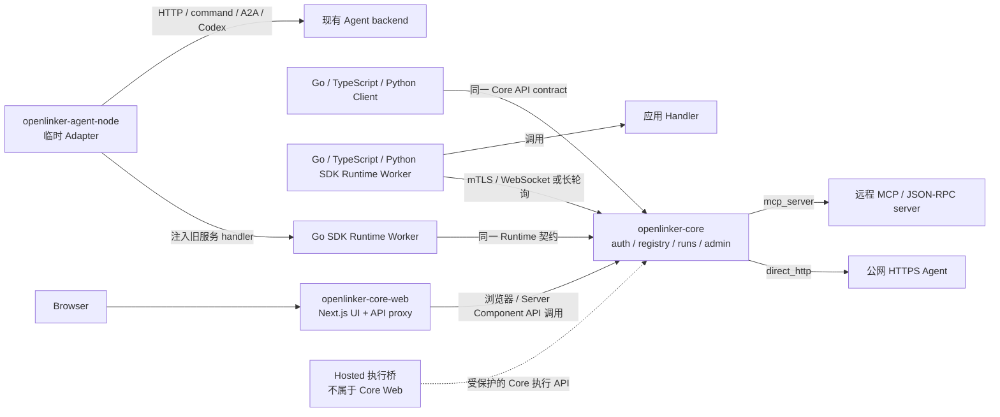

# OpenLinker Core Web

OpenLinker Core Web 是配套 [openlinker-core](https://github.com/OpenLinker-ai/openlinker-core) 自托管部署的**开源前端**。
它把 Agent Registry、接入配置、调用、运行记录和实例管理放进同一个浏览器界面，
适合希望在自己的基础设施中管理 Agent、账号和运行数据的团队。

> **仓库地图**
>
> | 仓库 | 定位 | 是否开源 |
> |----|----|----|
> | `openlinker-core` | 后端 API 服务 | ✅ 开源 |
> | `openlinker-core-web` ← **本仓库** | Core 的自托管前端 | ✅ 开源 |
> | 托管产品前端 | 独立的 openlinker.ai 托管服务 | 独立产品 |
>
> 本仓库以 `openlinker-core` API 为产品边界。部署方可以自行决定域名、访问方式、
> 数据保留和运维策略；openlinker.ai 的托管账号、商业计费和市场运营界面在独立产品中实现。

English documentation: [README.md](./README.md)

Core Web 只调用 Core 提供的 API，不依赖 openlinker.ai 托管账号或商业服务即可运行。

## 状态

本前端目前是 pre-1.0，并跟随 `openlinker-core` API 演进。Core 契约稳定前，路由、
表单和 API 响应处理仍可能变化。

`package.json` 版本属于 private 应用包，不是 npm 发布版本。部署版本应以 Git tag、镜像
标签和对应 Core 兼容记录为准。

User Token 管理属于 Core 的正式契约。Core 负责本地签发与验证，设置页支持创建、查看、
收紧、替换和撤销 Token；签发时可以设置有效期及 Agent 范围，明文 Token 只展示一次。

## 范围

包含：

- 公开 Agent Registry、Agent 详情页和可调用 Playground
- 邮箱密码注册与登录、个人工作区、run 历史、run 详情、Inbox 和设置
- 面向用户侧 API 与 MCP 调用的本地 User Token 管理，包括有效期、最小权限、Agent 范围、替换与撤销
- Creator Hub、三种连接模式的接入引导、可用性告警、Benchmark 和交付视图
- A2A console、MCP/connect、Skills、服务状态和运行详情
- 由 `openlinker-core` 支持的本地 admin 页面
- `/api/v1/*` 到 Core API 的代理

与 Core API 边界分离：

- Hosted 快捷登录、账号找回和托管账号认证
- 服务商品、服务订单、卖家运营和 Hosted Agent 市场运营
- 钱包、扣费、提现、Stripe 和价格页面
- openlinker.ai 托管账号、令牌策略和商业访问 Dashboard
- 财务管理和托管市场排序控制
- Core 契约之外的 Hosted 托管账户功能

Core Web 当前只提供邮箱密码注册和登录。仅在 Core 配置 Google / GitHub provider，
不会让本前端自动出现 Hosted 风格的快捷登录按钮。

## 开源架构图

Core Web 是面向 Core-owned API 的自托管 UI。Hosted 执行桥位于本仓库之外，通过受保护的
Core 边界工作，不会把商业账号或订单 API 路由进 Core Web。



## 快速开始

依赖：

- Node.js 20 或更高版本
- npm
- 正在运行的 `openlinker-core` API，通常是 `http://localhost:8080`

创建本地配置：

```bash
cp .env.local.example .env.local
```

安装依赖并启动开发服务器：

```bash
npm ci
npm run dev
```

默认本地地址：

- Core API: `http://localhost:8080`
- Core Web: `http://localhost:3000`

从父工作区使用 `make dev-core-web` 启动时，devctl 脚本改用 `3001` 端口，
避免与 `3000` 上的 Hosted 前端冲突。

## 环境变量

常见本地配置：

```bash
NEXT_PUBLIC_API_URL=http://localhost:3000
API_URL=http://localhost:8080
CORE_API_URL=http://localhost:8080
NEXTAUTH_SECRET=replace-me-with-32-chars-random-secret
NEXTAUTH_URL=http://localhost:3000
```

`NEXT_PUBLIC_API_URL` 通常指向前端自身，让浏览器请求走本地 Next.js `/api/v1/*`
代理。Server Components 使用 `CORE_API_URL` 或 `API_URL` 直接访问 Core。

`AUTH_SECRET` 或 `NEXTAUTH_SECRET` 用于签名前端会话。生产环境应使用独立随机值，
不要复用 Core 的 `JWT_SECRET`；如果两个前端变量同时设置，请保持它们的值一致。

## 常用命令

```bash
npm run dev
npm run lint
npx tsc --noEmit
npm run build
npm run start
npm run check:i18n
npm run test:a2a-session
npm run test:agent-library-card
```

## Docker

从父工作区根目录构建：

```bash
docker build -f openlinker-core-web/Dockerfile.server -t openlinker-core-web .
```

容器需要 `API_URL` 或 `CORE_API_URL` 指向 Core API。

## 项目结构

```text
openlinker-core-web/
├── src/proxy.ts
├── Dockerfile.server
├── src/app/
│   ├── page.tsx
│   ├── runs/
│   ├── my/
│   ├── settings/
│   ├── admin/
│   ├── (creator)/hub/
│   ├── (creator)/publish/
│   ├── registry/
│   └── api/v1/[...path]/route.ts
├── src/components/
├── src/messages/       # 类型化、按领域拆分的中英文产品文案
└── src/lib/
```

## API 代理模型

浏览器请求通常访问前端 origin。`src/app/api/v1/[...path]/route.ts` 会把 Core API
流量转发到 `CORE_API_URL` 或 `API_URL`。这样浏览器配置更简单，也避免暴露私有部署细节。

## 开发注意事项

- 不要把商业产品流程放进本仓库。
- 优先复用现有组件和布局模式。
- 跨页面复用或数量较多的功能文案放进 `src/messages/` 类型化领域模块；少量单组件文案可以留在组件附近。协议字段、代码示例和用户数据不进入翻译表。
- Core 文案以当前实例为语境。协议状态可以与 Hosted Web 保持一致，市场、计费和托管服务文案不能强行共用。
- 公开 Issue 前删除 token、私有 URL、客户数据和 `.env.local`。

## 安全

敏感区域包括 session、受保护路由、API proxy、token 展示/复制、用户可控 URL 和回调面。
漏洞请通过 [SECURITY.zh-CN.md](./SECURITY.zh-CN.md) 报告。

## 贡献

提交 PR 前请阅读 [CONTRIBUTING.zh-CN.md](./CONTRIBUTING.zh-CN.md)。新增页面和流程应由
`openlinker-core` 的公开 API 支持，并保持自托管部署可独立运行。

## 支持和发布

- 支持说明：[SUPPORT.zh-CN.md](./SUPPORT.zh-CN.md)
- 发布清单：[RELEASE.zh-CN.md](./RELEASE.zh-CN.md)
- 英文变更记录：[CHANGELOG.md](./CHANGELOG.md)
- 行为准则：[CODE_OF_CONDUCT.md](./CODE_OF_CONDUCT.md)

## 许可证

Apache-2.0。详见 [LICENSE](./LICENSE)。
